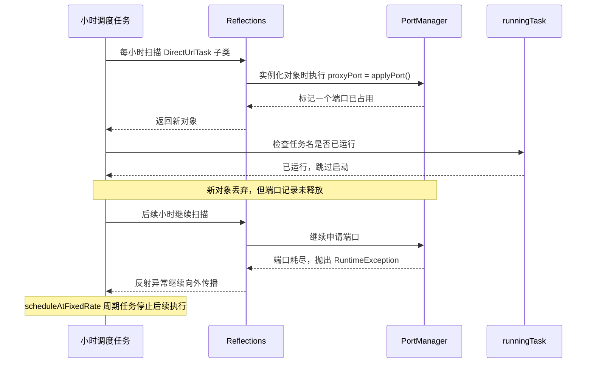

## 1. 问题概述

### 1.1 问题现象

爬虫服务启动后可以正常运行并持续抓取数据。运行约 10 天后，服务仍然存活，但不再产生新的爬取数据；重启服务后，爬虫任务恢复正常。该问题具有较强的周期性，通常需要约 10 天重启一次服务。

### 1.2 影响范围

- 小时级搜索爬取任务停止触发或无法产生有效数据。
- 直接链接解析任务长期占用资源。
- 服务进程本身不一定退出，容易被误判为服务正常。
- 重启可以暂时恢复，但不能消除代码中的资源泄漏。

### 1.3 分析结论

根因已经确认：

> `DirectUrlTask` 在对象实例化阶段通过字段初始化申请了端口，而不是只在任务运行时申请。调度线程每小时通过反射创建新的 `DirectUrlTask` 对象；当同名任务已经运行时，新对象会被跳过，但已申请的端口没有释放。长期运行后，`PortManager` 的端口记录耗尽，异常从小时调度任务中逃逸，导致 `scheduleAtFixedRate` 对应的周期任务停止后续执行。

重启后恢复的原因是端口占用记录保存在 JVM 静态内存中，服务重启后 `portRecorder` 被重新初始化为空闲状态。

---

## 2. 相关代码结构

### 2.1 小时级调度入口

启动入口位于 `SpiderMain.java`。服务启动时注册了三个周期任务，其中搜索任务每小时执行一次：

```java
scheduledExecutorService.scheduleAtFixedRate(
        buildSearchTask(), 0, 60, TimeUnit.MINUTES);

scheduledExecutorService.scheduleAtFixedRate(
        CopyrightWorkManager::syncCopyrightWork,
        0, 2, TimeUnit.HOURS);

scheduledExecutorService.scheduleAtFixedRate(
        logSystemInfo(), 10, 10, TimeUnit.MINUTES);
```

主线程随后执行：

```java
Thread.currentThread().join();
```

因此，某个周期任务停止并不会自动导致 JVM 进程退出，进程仍可能保持存活状态。

### 2.2 每小时任务的执行流程

`buildSearchTask()` 每次执行时会依次：

1. 获取关键词。
2. 反射创建搜索任务对象。
3. 将搜索任务提交到搜索线程池。
4. 反射创建文件解析任务对象。
5. 将解析任务提交到解析线程池。
6. 反射创建直接链接任务对象。
7. 启动尚未运行的直接链接任务。

关键代码：

```java
List<DirectUrlTask> urlTaskList =
        TaskUtils.getSubList(
                TaskUtils.URL_CLASS_PACKAGE,
                DirectUrlTask.class);

for (DirectUrlTask directUrlTask : urlTaskList) {
    startTaskThread(directUrlTask);
}
```

### 2.3 反射实例化任务对象

`TaskUtils.getSubList()` 通过反射扫描子类并执行无参构造方法：

```java
Set<Class<? extends T>> set = reflections.getSubTypesOf(clazz);

for (Class<? extends T> aClass : set) {
    if (aClass.isAnnotationPresent(Deprecated.class)) {
        continue;
    }
    list.add(aClass.getDeclaredConstructor().newInstance());
}
```

当前直接链接任务包括：

- `SousuoPanUrlTask`
- `CodelicenceUrlTask`

### 2.4 `DirectUrlTask` 的端口申请时机

关键代码如下：

```java
public abstract class DirectUrlTask extends AbstractTask {

    private int proxyPort = PortManager.applyPort();

    private ChromeInstance chromeInstance = null;
    private ProxyServerInstance proxyServer;
    private OkHttpClient httpClient;
```

这里的端口申请属于字段初始化，不属于 `init()` 方法。Java 通过反射执行 `newInstance()` 时，字段初始化会先于构造方法完成。

真正运行时的 `init()` 方法还会申请另一个调试端口：

```java
private void init() {
    if (hasInstance) {
        int debugPort = PortManager.applyPort();
        chromeInstance = buildChromeInstance(
                debugPort,
                proxyPort,
                getUserDir(),
                UAAgentUtil.generateRandomUserAgent(),
                null,
                () -> PortManager.releasePort(debugPort, proxyPort));
    }
    // ...
}
```

因此，实际顺序是：

```text
反射创建 DirectUrlTask
    ↓
字段初始化 proxyPort = PortManager.applyPort()
    ↓
构造方法执行
    ↓
startTaskThread 判断是否已运行
    ↓
如果未运行，启动线程并在线程中执行 init()
```

---

## 3. 关键故障分析过程

### 3.1 先区分“进程退出”与“任务停止”

现象是重启后恢复，因此首先需要判断：

- JVM 进程是否已经退出；
- 进程仍在，但周期调度是否停止；
- 周期调度仍在，但工作线程是否被阻塞；
- 任务是否执行，只是数据请求或数据保存失败。

代码中主线程通过 `join()` 长期等待，周期任务异常也不会直接让主线程退出。因此，“进程还在”不能证明“调度还在”。

### 3.2 检查周期任务是否有异常保护

`buildSearchTask()` 返回的 `Runnable` 外层没有 `try-catch`：

```java
private static Runnable buildSearchTask() {
    return () -> {
        List<String> keywordList = SeedUtil.getKeywords();
        // ...
        List<DirectUrlTask> urlTaskList =
                TaskUtils.getSubList(
                        TaskUtils.URL_CLASS_PACKAGE,
                        DirectUrlTask.class);
        // ...
    };
}
```

如果反射构造任务、线程提交或端口申请过程中抛出运行时异常，该异常会直接逃逸出周期任务。

`ScheduledExecutorService` 的周期任务一旦执行异常，后续周期通常会被取消。当前代码又没有保存 `ScheduledFuture`，因此无法从主线程获知该周期任务已经停止。

### 3.3 检查直接任务是否会重复实例化

`TaskUtils.getSubList()` 每小时都会创建新的直接任务对象，而 `DirectUrlTask.run()` 内部是无限循环：

```java
public void run() {
    try {
        init();
        while (true) {
            doRunTask();
        }
    } finally {
        // 关闭 Chrome 或代理
    }
}
```

第一次创建的任务会长期存在于 `runningTask` 中。下一小时创建的新对象会进入以下判断：

```java
if (!runningTask.contains(abstractTask.getTaskName())) {
    // 启动线程
}
```

此时，新对象虽然已经在字段初始化阶段申请了 `proxyPort`，但由于没有启动线程：

- 不会执行 `run()`；
- 不会执行 `finally`；
- 不会释放刚刚申请的 `proxyPort`。

这构成了确定性的端口记录泄漏。

### 3.4 检查端口池容量和耗尽行为

端口由 `PortManager` 使用 JVM 内存中的布尔数组记录：

```java
private static final int startPort = 9222;
private static final int maxPort = 10000;
private static final boolean[] portRecorder = new boolean[maxPort + 1];
```

代码位置：[`PortManager.java:8-12`](/Users/jimmy/IdeaProjects/puyu-spider/puyu-spider-task/src/main/java/com/iqiyi/puyu/spider/utils/PortManager.java:8)

端口申请失败时抛出异常：

```java
if (v < 1) {
    throw new RuntimeException("no valid port can use");
}
```

当前有两个直接任务，每小时扫描时至少会泄漏两个端口记录。端口池总量有限，按两个任务计算，理论耗尽时间约为 16 天。实际运行约 10 天，可能是以下因素共同缩短了时间：

- 其他异常路径也申请了端口但未释放；
- 某些任务启动失败发生在完整清理流程之前；
- 任务重复提交或阻塞导致资源长期占用；
- 线上版本的直接任务数量或运行配置与当前源码不同。

### 3.5 形成完整故障时间线



### 3.6 解释“重启后恢复”

`portRecorder` 是静态字段，生命周期与 JVM 进程一致：

```java
private static final boolean[] portRecorder = new boolean[maxPort + 1];
```

服务重启后：

1. JVM 退出，旧的 `portRecorder` 消失。
2. 新 JVM 初始化一份全新的端口记录数组。
3. `scheduledExecutorService` 重新创建。
4. 小时爬虫任务重新注册并开始执行。

因此重启表现为“恢复正常”，但本质上只是清空了进程内的泄漏状态。

---

## 4. 根因确认

### 4.1 直接根因

`DirectUrlTask` 的端口申请发生在对象字段初始化阶段，而对象每小时通过反射重复创建。已运行任务被跳过后，新对象没有机会执行清理逻辑，造成 `PortManager` 端口记录持续泄漏。

### 4.2 触发机制

端口记录耗尽后，`PortManager.applyPort()` 抛出异常。异常经过反射调用和 `TaskUtils.getSubList()` 包装后，从 `buildSearchTask()` 逃逸。

### 4.3 最终表现

小时级 `scheduleAtFixedRate` 任务被取消，主进程仍然存活，但之后不再正常调度爬虫任务。重启清空静态端口记录后恢复。

---

## 5. 其他发现的风险

这些问题不是本次主根因，但可能放大故障或造成类似现象。

### 5.1 固定线程池使用无界队列

```java
private static ExecutorService executorService =
        Executors.newFixedThreadPool(8);

private static ExecutorService diskDetailTaskService =
        Executors.newFixedThreadPool(2);
```

如果某些任务执行时间超过一小时，任务可能不断进入队列。

### 5.2 任务去重存在提交竞态

当前是在提交任务前检查 `runningTask`，但任务真正开始执行后才加入 `runningTask`：

```java
if (runningTask.contains(taskName)) {
    continue;
}
executorService.submit(runTask(taskName, abstractTask));
```

而 `runningTask.add(taskName)` 位于工作线程内部。已经提交但尚未开始执行的任务不会被视为运行中，后续小时可能重复提交。

### 5.3 代理刷新任务缺少异常兜底

代理列表每天刷新一次：

```java
schedule.scheduleAtFixedRate(
        proxyInstance::loadProxyList,
        1L, 1L, TimeUnit.DAYS);
```

如果代理服务临时异常并抛出未捕获异常，该刷新周期也可能停止，导致代理列表长期不更新。

### 5.4 周期任务的返回句柄没有保存

`scheduleAtFixedRate()` 返回的 `ScheduledFuture` 没有保存，也没有对任务执行状态进行监控。因此调度任务停止后，主线程无法主动感知。

---

## 6. 修复方案

### 6.1 P0：消除构造阶段的副作用

将字段初始化改为普通状态字段：

```java
private int proxyPort = -1;
```

在任务真正开始执行时申请：

```java
private void init() {
    proxyPort = PortManager.applyPort();
    // 后续初始化代理、Chrome 和 HTTP 客户端
}
```

更稳妥的方式是让任务扫描返回 `Class` 或任务元数据，只有通过运行状态检查后，才创建任务实例。这样即使任务已经运行，也不会为被跳过的对象执行构造阶段资源申请。

### 6.2 P0：保证所有资源都有明确的生命周期

端口、代理服务、ChromeDriver、临时目录都应遵循：

```text
申请资源
    ↓
启动任务
    ↓
正常完成或异常退出
    ↓
finally 释放资源
```

特别需要覆盖以下失败路径：

- 构造对象后任务未启动；
- 第二个端口申请失败；
- Chrome 启动失败；
- 代理启动失败；
- 线程启动失败。

### 6.3 P0：保护周期调度任务并增加健康检查

周期任务应使用统一包装器记录：

- 触发时间；
- 开始时间；
- 完成时间；
- 异常信息；
- 最近一次有效数据时间；
- 连续失败次数。

同时保存 `ScheduledFuture`，并增加调度心跳，避免“进程存活但调度停止”无法被发现。

### 6.4 P1：修复任务去重和线程池背压

- 在提交任务前原子地占用任务名。
- 使用 `ConcurrentHashMap<String, Future<?>>` 管理任务实例。
- 使用有界队列，设置合理的拒绝策略。
- 对任务设置最大执行时间。
- 任务超时后取消、清理资源并解除运行状态。

### 6.5 P1：补充外部调用超时

应检查并配置：

- Selenium 页面加载、脚本和命令执行超时；
- JDBC 连接、读取和 socket 超时；
- HTTP 连接、读取和整体调用超时；
- 线程池任务超时和队列长度告警。

---

## 7. 验证方案

### 7.1 修复前线上确认

检查日志中的：

- `申请端口`；
- `释放端口`；
- `关键词：`；
- `任务线程已启动`；
- `任务执行开始`；
- `任务执行结束`。

如果申请数量持续大于释放数量，应确认端口泄漏。

如果故障时不再出现 `关键词：`，说明小时调度任务已经停止；如果关键词日志仍在但没有任务开始日志，则应继续检查线程池队列和 `runningTask` 状态。

### 7.2 修复后回归验证

至少连续运行超过原故障周期，并确认：

1. 每小时都有调度触发记录。
2. 端口申请数和释放数最终保持平衡。
3. 已运行的直接任务不会重复创建实例。
4. 线程池队列不会持续增长。
5. 代理刷新失败后能够重试并恢复。
6. 任务异常后仍能在下一周期重新执行。
7. 最近有效数据时间持续更新。

### 7.3 线上应急操作

在修复版本上线前，如果再次发生相同故障，重启服务可以清空 JVM 内存中的端口记录并临时恢复任务。但这只是应急措施，不能替代代码修复。

---

## 8. 最终结论

本次问题的主因是 `DirectUrlTask` 构造阶段申请端口导致的资源泄漏，而不是 `init()` 方法在对象实例化阶段被调用。

准确的执行过程是：

```text
反射实例化对象
→ 字段初始化阶段申请 proxyPort
→ 任务已运行，新的对象被跳过
→ 被跳过对象没有释放 proxyPort
→ 端口记录逐小时泄漏
→ 端口耗尽抛出异常
→ 小时级周期调度任务停止
→ JVM 进程仍存活但不再抓取
→ 重启后静态端口记录清空，任务恢复
```

优先修复构造阶段资源申请、完善异常和资源清理边界，并增加调度心跳和端口资源监控，即可解决本次问题并避免同类问题再次发生。

